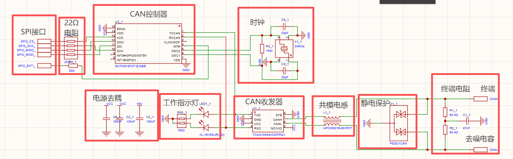

# 中北大学SPI转CAN方案


## 主要链路



## 1.SPI接口

### 1.1 SPI_CS:

片选线，决定和谁进行通信/是否进行通信，大多数为低电平有效

CS:1 未开始通信

CS:0 开始通信

CS:1 结束本次通信

### 1.2 SPI_SCK:

时钟线，SPI 时钟，由 STM32 产生，供双方按照时钟边沿采样和发送数据。

### 1.3 SPI_MISO:

主机接收，从机发送

M:Master 主机，一般指STM32

I:Input 接收

S:Slave 从机，例如此处的CAN控制器，还有部分OLED显示屏，部分传感器和一些无线模块

O:Out 发送

### 1.4 SPI_MOSI

主机发送，从机接收


SPI:同步、全双工通信，能够同时接收和发送信号，通信速度快，适合对传输速度要求高的情况。


## 2.MCP2518FD  CAN控制器

MCP2518FD把STM32通过SPI交给他的数据，转化为标准的CAN/CAN FD报文；也可以把总线上收到的报文暂存起来，等待STM32读取。

### 2.1 引脚连接关系

| MCP2518FD引脚       | 连接对象                     | 方向                  | 作用                                        |
| ------------------- | ---------------------------- | --------------------- | ------------------------------------------- |
| `VDD`               | `VCC`                        | 电源输入              | 为MCP2518FD供电                             |
| `VSS`               | `GND`                        | 电源地                | 芯片的电流返回路径和电压参考点              |
| `EPAD`              | `GND`                        | 接地                  | 芯片底部焊盘，用于可靠接地、散热和降低噪声  |
| `nCS`               | `SPI2_CS`，经过22Ω电阻       | STM32 → MCP2518FD     | SPI片选信号，低电平有效                     |
| `SCK`               | `SPI2_SCK`，经过22Ω电阻      | STM32 → MCP2518FD     | SPI时钟，由STM32产生                        |
| `SDI`               | `SPI2_MOSI`，经过22Ω电阻     | STM32 → MCP2518FD     | 接收STM32发来的命令、地址和数据             |
| `SDO`               | `SPI2_MISO`，经过22Ω电阻     | MCP2518FD → STM32     | 向STM32返回寄存器、状态和CAN报文            |
| `INT#`              | `SPI2_EXTI`，经过22Ω电阻     | MCP2518FD → STM32     | 有新报文、错误等事件时通知STM32，低电平有效 |
| `TXCAN`             | TCAN1044A的`TXD`             | MCP2518FD → TCAN1044A | 向CAN收发器输出待发送的逻辑数据             |
| `RXCAN`             | TCAN1044A的`RXD`             | TCAN1044A → MCP2518FD | 接收CAN收发器还原出的总线逻辑数据           |
| `OSC1`              | 20MHz晶振、20pF电容和1MΩ电阻 | 时钟端                | 与`OSC2`共同构成晶振电路                    |
| `OSC2`              | 20MHz晶振、20pF电容和1MΩ电阻 | 时钟端                | 与`OSC1`共同产生芯片工作时钟                |
| `CLKOUT/SOF`        | 图中未连接                   | 可配置输出            | 可输出时钟或CAN帧开始信号                   |
| `INT0#/GPIO0/XSTBY` | 图中未连接                   | 可配置输入/输出       | 可作为额外中断、GPIO或收发器待机控制        |
| `INT1#/GPIO1`       | 图中未连接                   | 可配置输入/输出       | 可作为额外中断或普通GPIO                    |

### 2.2 22Ω电阻

用来改善高速数字信号质量

#### 2.2.1 抑制信号反射

导线和芯片引脚的阻抗变化较大，可能会产生反射波，用电阻吸收反射波，避免反射波来回振荡，减少影响。

这种情况主要发生在高速信号传播的情况下，反射是否明显，主要取决于信号边沿速度、走线长度和阻抗是否匹配，而不只是通信频率。对于短走线或边沿较慢的信号，反射影响可能不明显。

#### 2.2.2 降低电磁干扰

高低电平的瞬间转化，剧烈的变化会产生高频噪声和电磁干扰，加入电阻后可以适当延缓变化速度，降低高频噪音和电磁干扰，减少对外部设备的电磁辐射。

#### 2.2.3 为什么是22Ω？

太小抑制信号反射效果不明显。

太大影响高速通信速度。

22Ω是信号完整性设计中的常用折中值，在抑制反射、降低电磁干扰和保持通信速度之间取得平衡。

如果条件允许可以结合仿真或示波器验证测试得到更好的数值。

## 3.TCAN1044AV CAN收发器

TCAN1044AV 负责“把报文变成电信号传到 CAN 线上。

**与MCP2518FD对比：**

MCP2518FD：通过 SPI 与 STM32 通信，并负责 CAN 协议处理

TCAN1044AV：在 TXD/RXD 逻辑接口与 CANH/CANL 物理总线之间转换信号

### 3.1 引脚连接关系：

| 信号 | 作用                                                         |
| ---- | ------------------------------------------------------------ |
| TXD  | 收发器的发送输入，接 MCP2518FD 的 TXCAN                      |
| RXD  | 收发器的接收输出，接 MCP2518FD 的 RXCAN                      |
| CANH | CAN 差分总线高线                                             |
| CANL | CAN 差分总线低线                                             |
| VCC  | 收发器主电源，图中接 +5V                                     |
| VIO  | 逻辑接口电源，匹配控制器的逻辑电平                           |
| STB  | 工作模式控制，STB=0 正常通信，STB=1 待机模式，降低功耗。此处STB接GND,上电后默认处于正常通信状态。 |
| GND  | 地                                                           |

## 4.L1:CAN共模电感

要理解这个模块的作用，首先要理解 CAN 通信是如何传递数据的。

CAN 使用差分信号传输数据。CAN 总线主要由两根线组成：CANH 和 CANL。接收器主要判断这两根线之间的电压差，而不是单独判断某一根线对地的电压。

本电路为 TCAN1044AV 的 VCC 提供 5V 电源；VIO 用于匹配逻辑接口的电平。

当总线处于隐性状态时，CANH 和 CANL 的电压通常都接近 2.5V，二者的电压差接近 0。这里的隐性状态不等于没有数据，因为一个 CAN 报文中也可能包含隐性位。

当总线进入显性状态时，收发器会主动驱动 CANH 和 CANL，使 CANH 电压升高、CANL 电压降低。例如，CANH 可能约为 3.5V，CANL 可能约为 1.5V，两者之间形成约 2V 的电压差。此时接收器就可以识别出显性位。具体电压会受到收发器、终端电阻和总线负载的影响。

因此，CAN 的正常差分信号会在 CANH 和 CANL 上形成相反方向的电流。L1 实际上由两个绕在同一磁芯上的线圈组成，分别串联在 CANH 和 CANL 上。对于正常的 CAN 差分信号，两根线中的电流方向相反，两个线圈产生的磁通方向相反，理想情况下会相互抵消。因此，L1 对正常 CAN 信号的影响较小。

但是，电机、开关电源或外部线缆可能会在 CANH 和 CANL 上同时引入高频干扰。例如，两根线都受到相同方向的干扰电流影响，这种干扰称为共模干扰。对于共模干扰，两个线圈产生的磁通方向相同，会相互叠加，使 L1 对高频共模电流呈现较大的阻抗，从而限制干扰电流的快速变化，削弱干扰。

但你可能会问，如果CANH和CANL都增加1V，对于信号传输似乎没什么影响，确实是这样。如果干扰完全相同地加在 CANH 和 CANL 上，理想情况下 CANH 与 CANL 的电压差不会改变，CAN 接收器可以抵消这部分干扰。但现实中的干扰通常不会完全相同，可能会有幅度和相位差异，这时部分共模干扰可能转化为差模干扰并影响通信。因此，L1 可以在干扰进入收发器或外部线缆之前，先削弱高频共模噪声，提高通信可靠性。

由于 CAN 使用差分传输，CANH 和 CANL 在 PCB 上设计通常会尽量靠近、平行布线，并保持长度接近。这样可以让外部干扰尽可能同时耦合到两根线上，从而更容易被差分接收器抵消。

总之就是，L1 对正常 CAN 差分信号影响较小，但会对高频共模干扰呈现较大阻抗，从而降低高频共模干扰和电磁辐射。

## 5.D1 PESD1CAN 静电保护器件

该器件由两个TVS / ESD 瞬态保护二极管，主要作用为静电保护，防止瞬间高压击穿芯片。

### 5.1 工作原理

对于正常的CAN信号，电压一般在5V以内，此时达不到二极管的导通条件，当线缆中传入一个很高的瞬态电压时，此时CANH或CANL上的电压高于二极管的击穿电压（25.4V~30.3V），二极管被击穿，瞬态电流通过 D1 泄放到保护地或回流路径，从而实现保护作用。

### 5.2 要防什么

- 手摸产生的静电
- 电机产生的电压尖峰
- 插拔线缆产生的瞬态冲击
- 外部设备传入的浪涌

这些异常电压可能直接损坏 TCAN1044AV。

### 5.3 放置位置

通常放置在接口附近，因为异常电压一般从外部CAN接口进入，放在接口附近可以在异常电压接触到CAN收发器之前就把异常电压吸收掉。

## 6.R1_2,R2_2终端电阻

CAN的终端电阻一般为120Ω，此处将120Ω的电阻拆分为两个60.4Ω的电阻，用于接C1电容。C1电容作用在下一点进行讲解。

### 6.1 为什么要终端电阻

该终端电阻的主要作用是吸收信号能量，防止反射。

若没有终端电阻，末端也没有合适的负载，信号能量到达末端后会反弹回去，就像水撞到墙上一样。电信号反射可能会造成：

- 波形振铃
- 过冲和下冲
- 接收器误判
- 通信不稳定

故使用终端电阻来吸收多余能量，减少反射。

## 7. C1电容作用

C1接在R1,R2中点和GND之间，对于直流或低频信号，C1 相当于开路；对于高频共模干扰，C1 的阻抗较低，可以为干扰提供到 GND 的旁路。从而降低噪声和电磁辐射。对于共模干扰进一步削弱。

## 8. 电源去耦

C2,C3,C6是电源去耦电容，用于在芯片附近稳定电源，减少电源线上突然出现的电压波动和高频噪声。

### 8.1 为什么会有电压波动？

芯片内部由无数晶体管组成，晶体管切换状态实际上就是小电容在充电放电，所以芯片可能会导致电源短暂拨动，使用一个电容来减小波动干扰，使供电更稳定。在电流不足时，电容也可以额外放电提供临时电流。

## 9. 20MHz 晶振时钟模块

### 9.1 时钟是什么？

时钟是芯片内部统一工作节奏的周期信号。

本电路使用 20MHz 时钟，表示每秒振荡 2000 万次，一个周期约为 50ns。MCP2518FD 根据这个时钟确定 CAN 数据的采样、发送和内部逻辑执行时间。

### 9.2 X1：20MHz 晶振

X1 像一个只容易在 20MHz 附近振动的“电子音叉”。

它与 MCP2518FD 内部的振荡电路配合，产生稳定的 20MHz 时钟。X1 主要决定时钟频率。

### 9.3 C4、C5：负载电容

C4、C5 分别接在晶振两端和 GND 之间，作用是：

- 给晶振提供合适的负载
- 帮助振荡器启动
- 提高时钟稳定性

图中使用 20pF，但实际值需要根据晶振数据手册和 PCB 寄生电容确定。

### 9.4 R3：反馈电阻

R3 为 1MΩ，连接在 OSC1 和 OSC2 之间。

它为振荡器提供很弱的反馈和偏置，帮助晶振启动并保持稳定振荡。R3 不负责设置 20MHz 频率，频率主要由 X1 决定。

### 9.5 总结

```text
X1：决定频率
C4/C5：提供负载，帮助稳定
R3：提供弱反馈，帮助启动
```

如果晶振模块工作异常，可能导致 MCP2518FD 启动失败、CAN 波特率不准确或通信错误。

PCB 布局时，X1、C4、C5 应尽量靠近 MCP2518FD 的 OSC1、OSC2 引脚，走线保持短且对称，并远离 SPI 时钟、CAN 线和电机电源线。

参考：[MCP2518FD 数据手册](https://ww1.microchip.com/downloads/aemDocuments/documents/OTH/ProductDocuments/DataSheets/External-CAN-FD-Controller-with-SPI-Interface-DS20006027B.pdf)

## 10. LED1 与 RN1：通信状态指示模块

### 10.1 LED1：状态指示灯

LED 是一种发光二极管，电流按照正确方向通过时会发光。

图中的 LED1 用于表示通信活动，通常分为：

- TX：正在发送数据
- RX：正在接收数据

LED1 可以帮助观察芯片是否存在发送或接收动作。

需要注意：

> LED 亮只能说明相关逻辑信号发生了变化，不代表 CAN 总线通信一定完全正常。

### 10.2 RN1：电阻阵列

RN1 是由多个电阻组成的封装器件，图中阻值为 10kΩ。

它主要与 LED 串联，用于限制 LED 电流：

逻辑信号 → RN1 → LED → GND

如果没有限流电阻，LED 导通时可能产生过大电流，导致 LED 损坏或增加芯片 GPIO 的负担。

### 10.3 为什么使用电阻阵列？

相比使用多个独立电阻，电阻阵列可以：

- 节省 PCB 空间
- 减少元件数量
- 方便布线
- 让多个指示灯的限流参数更接近

## 11. 整体工作流程梳理

### 11.1 发送流程

STM32
  ↓ SPI
MCP2518FD
  ↓ TXCAN
TCAN1044AV
  ↓ 
CANH / CANL
  ↓
CAN接口

### 11.2 接收流程

CAN接口

  ↓

CANH / CANL
  ↓
TCAN1044AV
  ↓ RXD
MCP2518FD 的 RXCAN
  ↓ SPI读取
STM32

### 11.3 总结

STM32 通过 SPI 控制 MCP2518FD，MCP2518FD 负责 CAN 协议处理，TCAN1044AV 负责物理电平转换，CANH/CANL 负责连接外部总线，L1、D1、R1/R2、C1 负责抗干扰、保护和信号匹配。
